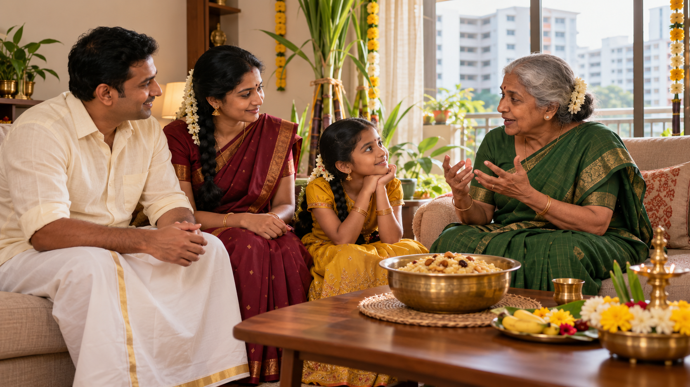
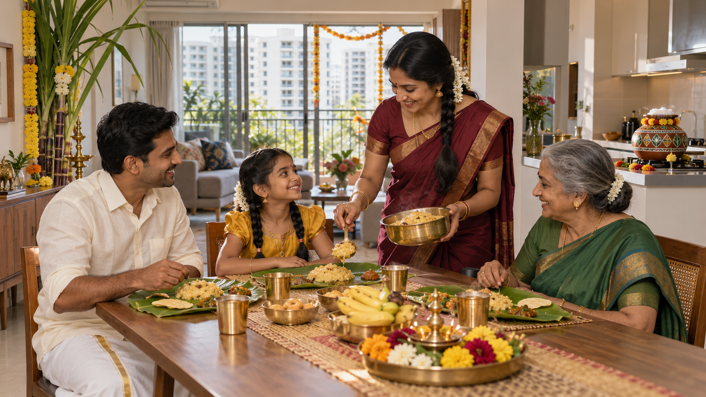
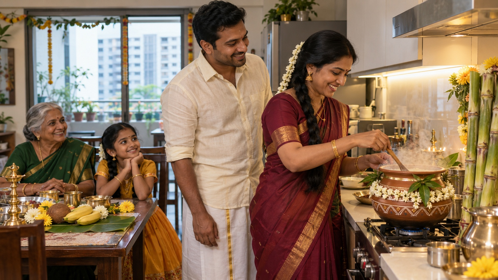
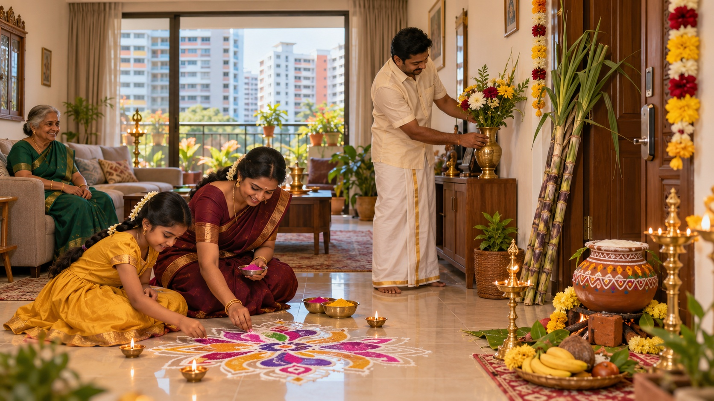
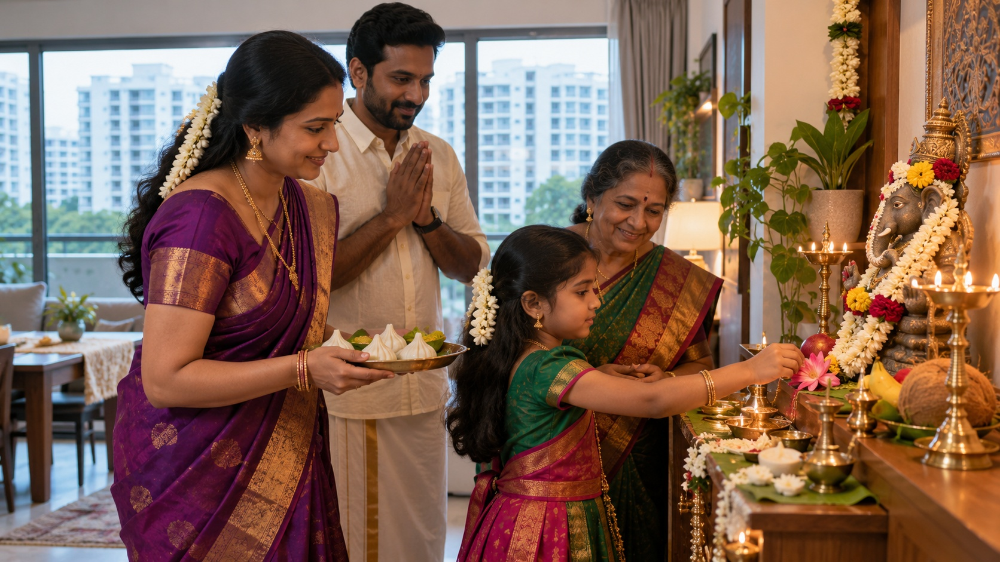
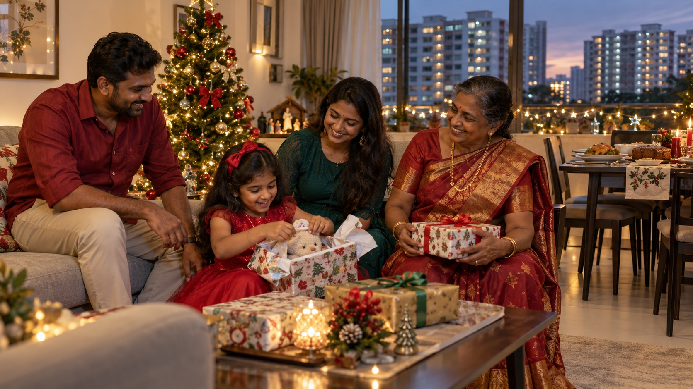
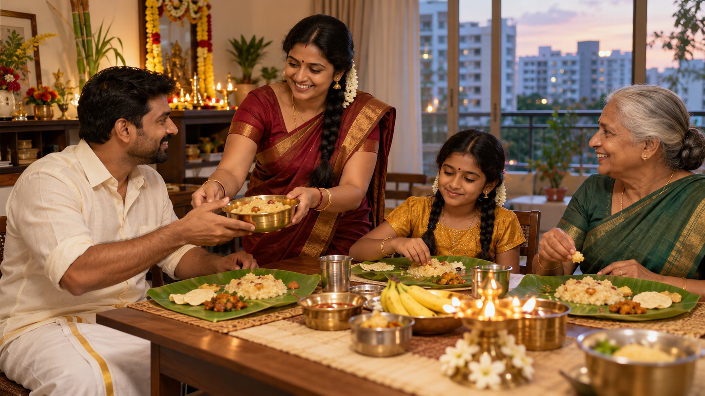

# About Markdown Format

Markdown (`.md`) stores human-readable project instructions, while JSON (`.json`) organizes image and video parameters.

## Project context

**Title:** How Tamil People Celebrate Festivals in Singapore

**Role:** Act as a culturally respectful visual storyteller and documentary filmmaker.

**Task:** Design realistic festival image prompts and a 60-second Pongal video with Tamil narration.

**Context:** Portray fictional Tamil families living in contemporary Singapore apartments. Pongal is the main story. Separate examples cover Vinayagar Chathurthi for a Tamil Hindu family and Christmas for a Tamil Christian family. Do not imply that all Tamil people follow the same religion or celebrate every festival.

## SCALE framework

| Letter | Meaning | Question |
|---|---|---|
| S | Subject | Who or what appears? |
| C | Composition | How are the visual elements arranged? |
| A | Action | What are people doing? |
| L | Location | Where does the scene happen? |
| E | Aesthetic | What style, mood and lighting should be used? |

Composition is the correct term for visual arrangement. This project deliberately uses Action for A, as requested; the reference repository used Angle. Camera angles can be specified separately.

## Markdown example

```markdown
# Pongal in Singapore
## Context
A fictional Tamil family celebrates Pongal at home.
- Keep the same characters.
- Show modern Singapore surroundings.
[Photo prompt](Basic_prompt_for_photo_generation.json)
```

## Review checklist

- Preserve realistic faces, hands and clothing.
- Use contemporary apartment surroundings.
- Keep each festival’s decorations and rituals separate.
- Verify Tamil narration and clip duration.
- Describe generated scenes as illustrative, not recordings of real events.


## 1. Cozy Pongal Family Gathering

The family gathers while grandmother shares a story.

**Prompt:** [Pongal_Family_Gathering_Prompt.json](Pongal_Family_Gathering_Prompt.json)




## 2. Pongal Morning Family Meal

Meena serves sweet Pongal to the family.

**Prompt:** [Basic_prompt_for_photo_generation.json](Basic_prompt_for_photo_generation.json)




## 3. Pongal Cooking in an Apartment

The family gathers while Meena prepares Pongal in the kitchen.

**Prompt:** [Pongal_Cooking_Prompt.json](Pongal_Cooking_Prompt.json)




## 4. A Tamil Home Prepared for Pongal

The family decorates their Singapore home with flowers, kolam, and sugarcane.

**Prompt:** [Tamil_Home_Pongal_Prompt.json](Tamil_Home_Pongal_Prompt.json)




## 5. Vinayagar Chathurthi Celebration

A Tamil Hindu family offers flowers and kozhukattai beside a home shrine.

**Prompt:** [Vinayagar_Chathurthi_Prompt.json](Vinayagar_Chathurthi_Prompt.json)




## 6. Christmas Celebration

A Tamil Christian family exchanges gifts beside a decorated Christmas tree.

**Prompt:** [Christmas_Celebration_Prompt.json](Christmas_Celebration_Prompt.json)




## 7. Cozy Family Pongal Celebration

The family shares sweet Pongal and enjoys a festive meal together.

**Prompt:** [Pongal_Family_Celebration_Prompt.json](Pongal_Family_Celebration_Prompt.json)


