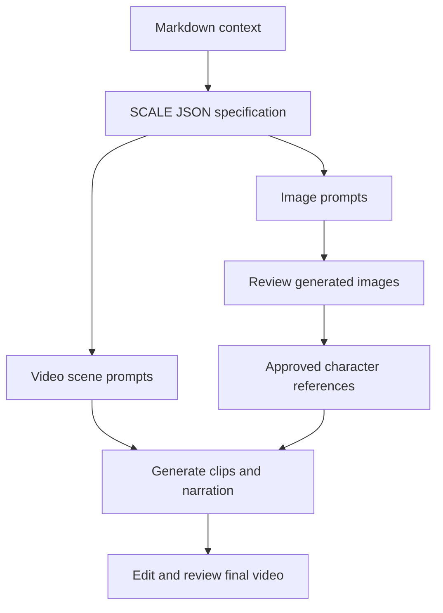

# How Tamil People Celebrate Festivals in Singapore

> **A structured approach to portraying Tamil festival celebrations in Singapore using Markdown, JSON, and the SCALE framework.**

## Navigation

- [About Markdown Format](ABOUT_MARKDOWN_FORMAT.md)
- [Basic Photo Generation Prompt](Basic_prompt_for_photo_generation.json)
- [Singapore Festival Image Prompts](singapore_based_celeb.json)
- [Pongal Video Prompt](pongal_video_prompt.json)
- [AI Image Examples](#ai-image-examples)
- [AI Video Example](#ai-video-example)

---

## Project Overview

Generative AI can turn creative ideas into festival images and video scenes. This project organizes those ideas into reusable prompts about fictional Tamil families living in contemporary Singapore.

**How Tamil People Celebrate Festivals in Singapore** uses:

- **Markdown** for readable context and instructions.
- **JSON** for structured prompt parameters.
- **SCALE** for organizing visual requirements.
- **Image prompting** for Pongal, Vinayagar Chathurthi, and Christmas scenes.
- **Video prompting** for a six-scene Pongal story with Tamil narration.

The overall approach is: human intent → Markdown context → structured JSON → SCALE specification → AI generation → reviewed image or video output.

Pongal is the main family story. Vinayagar Chathurthi and Christmas appear as separate examples for fictional Tamil Hindu and Tamil Christian families. The project does not imply that all Tamil people share the same religion or festival practices. Images are AI-generated illustrations, not photographs documenting real families.

---

## What is JSON Prompting?

A JSON prompt represents an AI request as structured fields instead of one continuous instruction.

### Traditional Text Prompt

```text
Create a realistic image of a Tamil family celebrating Pongal
in a modern Singapore apartment. Show the mother serving sweet
Pongal, warm morning light, and residential buildings through a window.
```

### Structured JSON Prompt

```json
{
  "title": "Pongal Morning in a Singapore Tamil Home",
  "framework": "SCALE",
  "S_subject": "A fictional multigenerational Tamil family",
  "C_composition": "Wide eye-level view of the family at a dining table",
  "A_action": "The mother serves cooked sweet Pongal to the seated family",
  "L_location": "A contemporary Singapore HDB apartment",
  "E_aesthetic": "Photorealistic style and warm morning light"
}
```

The same creative intent is separated into explicit properties. The JSON is a creative specification; tools with strict API schemas require a separate mapping to supported parameters.

---

## Why Use JSON Prompting?

### Structure

Requirements have clearly defined fields.

### Clarity

Subject, action, setting, and visual style can be reviewed separately.

### Reusability

The same pattern can describe different festivals and scenes.

### Consistency

Repeated character descriptions help specify a coherent family story.

### Extensibility

Motion, camera, narration, and timing can be added for video.

### Automation

JSON can be validated, edited, stored, and passed between software components.

> **JSON provides organization; output quality still depends on clear instructions, tool capabilities, reference images, and human review.**

---

## Text Prompt vs JSON Prompt

| Text Prompt | JSON Prompt |
|---|---|
| Natural and conversational | Structured and machine-readable |
| Quick for simple ideas | Useful for detailed specifications |
| Requirements may be mixed together | Requirements are separated into fields |
| Easy to write directly | Easy to validate and reuse |
| Flexible wording | Explicit hierarchy |

---

## SCALE Framework

This project uses **Action** for A, following the requested convention.

| Letter | Meaning | Prompt Focus |
|---|---|---|
| **S** | Subject | Who or what is shown? |
| **C** | Composition | How are the elements arranged? |
| **A** | Action | What are people doing? |
| **L** | Location | Where does the scene take place? |
| **E** | Aesthetic | What style, lighting, and mood are used? |

Camera angles are described within composition or separate video Camera fields.

---

## Project Architecture



---

# AI Image Examples

The project includes seven generated images: six festival examples and an additional Pongal morning image.

## 1. Pongal Cooking in an Apartment

Family members gather while Meena prepares Pongal on a kitchen stove.

**Prompt:** [singapore_based_celeb.json](singapore_based_celeb.json)


---

## 2. A Tamil Home Prepared for Pongal

The family arranges flowers, kolam, and sugarcane in a modern apartment.

**Prompt:** [singapore_based_celeb.json](singapore_based_celeb.json)


---

## 3. Cozy Pongal Family Gathering

Grandmother tells a story while the family sits together.

**Prompt:** [singapore_based_celeb.json](singapore_based_celeb.json)


---

## 4. Cozy Family Pongal Celebration

The family shares sweet Pongal at the dining table.

**Prompt:** [singapore_based_celeb.json](singapore_based_celeb.json)


---

## 5. Vinayagar Chathurthi at a Singapore Tamil Home

A fictional Tamil Hindu family offers flowers and kozhukattai beside a home shrine.

**Prompt:** [singapore_based_celeb.json](singapore_based_celeb.json)


---

## 6. Christmas at a Singapore Tamil Home

A fictional Tamil Christian family exchanges gifts beside a decorated Christmas tree.

**Prompt:** [singapore_based_celeb.json](singapore_based_celeb.json)


---

## 7. Pongal Morning in a Singapore Tamil Home

Meena serves already-cooked sweet Pongal to the seated family.

**Prompt:** [Basic_prompt_for_photo_generation.json](Basic_prompt_for_photo_generation.json)


---

# AI Video Example

## Pongal Celebration in a Singapore Tamil Home

The video prompt extends the family story into **six connected 10-second scenes**, targeting a 60-second video with Tamil narration.

### Story

| Scene | Duration | Activity |
|---|---|---|
| 1 | 10 seconds | Preparing the home with kolam and flowers |
| 2 | 10 seconds | Preparing rice, jaggery, and cooking utensils |
| 3 | 10 seconds | Cooking Pongal in the kitchen |
| 4 | 10 seconds | Offering thanks together |
| 5 | 10 seconds | Sharing the festive meal |
| 6 | 10 seconds | Family conversation and togetherness |

### Video Prompt

**[Open the complete Pongal video prompt](pongal_video_prompt.json)**

The JSON includes SCALE, Motion, Camera, Timing, Narration, SoundDesign, and Continuity fields.

### Continuity Approach

- Use the same fictional family, faces, clothing, and apartment.
- Attach approved character references where the tool supports them.
- Use the same documentary style and consistent lighting within each scene.
- Keep Tamil narration clear and background music quiet.
- Join clips with simple editorial cuts.
- Review identity, anatomy, audio, and duration before export.

### Final Video

**Status: Pending — the final MP4 has not been generated or supplied.**

[Watch Pongal Celebration in Singapore](./Singapore_Tamil_Pongal_Celebration.mp4)

This is the planned relative video link. It will work after you add `Singapore_Tamil_Pongal_Celebration.mp4` beside this README and push it to GitHub. If you host the video elsewhere, replace the relative target with the actual hosted video URL. No finished video is claimed by this link.

---

# Prompt-to-Output Flow

1. Define the festival, family, action, and Singapore setting.
2. Organize the instructions using SCALE.
3. Store the specification in JSON.
4. Generate and review images.
5. Use approved references to generate video scenes.
6. Add Tamil narration and quiet music.
7. Join and review six clips for the final 60-second video.

---

## Repository Structure and File Purpose

All files sit beside README.md in the project folder.

| File | Purpose | Status |
|---|---|---|
| README.md | Overview, navigation, image previews, and video link | Included |
| ABOUT_MARKDOWN_FORMAT.md | Markdown context and SCALE instructions | Included |
| Basic_prompt_for_photo_generation.json | Basic family photo specification | Included |
| singapore_based_celeb.json | Six festival image specifications | Included |
| pongal_video_prompt.json | Six-scene Pongal video specification | Included |
| singapore_pongal_in_an_apartment.jpg | Pongal cooking image | Included |
| singapore_tamil_home.jpg | Home decoration image | Included |
| cozy_pongal_family_gathering.png | Family gathering image | Included |
| cozy_family_pongal_celebration.png | Shared Pongal meal image | Included |
| vinayagar_chathurthi.jpg | Vinayagar Chathurthi image | Included |
| christmas_celebration.jpg | Christmas image | Included |
| pongal_morning_family_meal.png | Additional Pongal morning image | Included |
| Singapore_Tamil_Pongal_Celebration.mp4 | Final 60-second video | Pending; not included |

---

## Open in VS Code and Upload to GitHub

1. Extract the project ZIP and copy the project folder into your local repository.
2. Open the repository in VS Code.
3. Open this README and press **Ctrl+Shift+V** to preview it.
4. Keep the images and JSON files beside this README so relative links work.
5. Add the MP4 later using the exact filename above, or replace its link with a hosted URL.
6. Stage only this project folder, review the staged changes, commit, and push.

No Python environment or requirements.txt is needed for this prompt-and-media repository.

## Output Review Notes

The generated home-decoration image contains an indoor floor hearth that differs from the intended kitchen-only cooking setup. Correct that detail before using it as an exact video reference. Pongal character identities are similar but not guaranteed identical because the images were generated separately.

---

## Key Takeaway

> **Markdown organizes context. JSON organizes parameters. SCALE organizes visual intent. Reviewed AI outputs illustrate the festival story.**

## Reference

Project organization is inspired by [JSON Prompt Architect](https://github.com/ksmurari1/json-prompt-architect). The prompts and images here were created for the Singapore Tamil festival topic.
